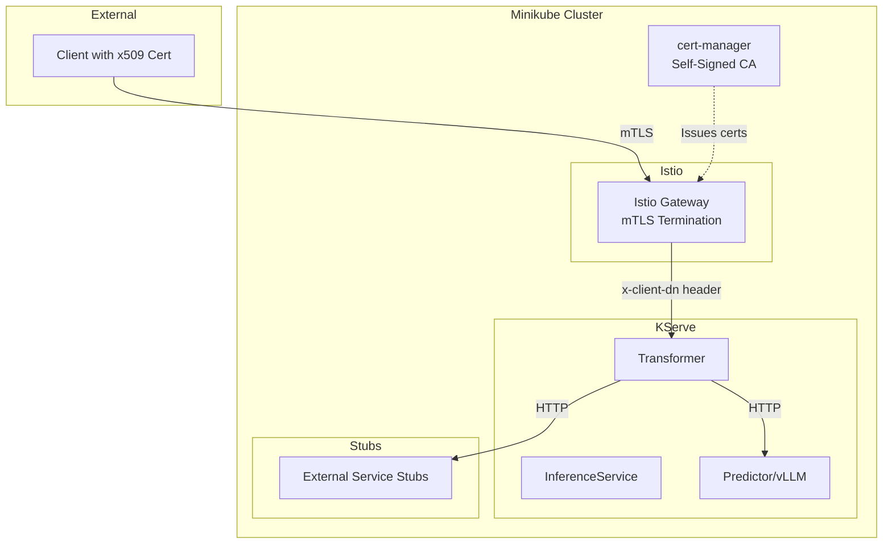

# Minikube Testing Guide: mTLS, Istio, and KServe

This guide covers testing the ML inference platform on Minikube with:
- Self-signed CA for mTLS authentication
- Istio service mesh integration
- KServe InferenceService deployment

## Prerequisites

| Requirement | Version | Purpose |
|-------------|---------|---------|
| Docker | 20.10+ | Container runtime |
| Minikube | 1.30+ | Local Kubernetes cluster |
| kubectl | 1.28+ | Kubernetes CLI |
| curl | any | Testing endpoints |
| openssl | any | Certificate operations |

## Architecture Overview



---

## Testing Checklist

### Phase 1: Environment Setup

- [ ] **Start Minikube with sufficient resources**

```bash
minikube start \
  --cpus=4 \
  --memory=16384 \
  --disk-size=50g \
  --driver=docker \
  --kubernetes-version=v1.28.0
```

- [ ] **Enable required addons**

```bash
minikube addons enable metrics-server
minikube addons enable storage-provisioner
```

- [ ] **Verify cluster is running**

```bash
kubectl cluster-info
kubectl get nodes
```

### Phase 2: Install Istio

- [ ] **Download and install Istio CLI**

```bash
curl -L https://istio.io/downloadIstio | ISTIO_VERSION=1.20.0 sh -
export PATH=$PWD/istio-1.20.0/bin:$PATH
```

- [ ] **Install Istio with demo profile**

```bash
istioctl install --set profile=demo -y
```

- [ ] **Verify Istio installation**

```bash
kubectl get pods -n istio-system
istioctl verify-install
```

- [ ] **Enable sidecar injection for default namespace (optional)**

```bash
kubectl label namespace default istio-injection=enabled
```

### Phase 3: Install cert-manager with Self-Signed CA

- [ ] **Install cert-manager**

```bash
kubectl apply -f https://github.com/cert-manager/cert-manager/releases/download/v1.14.0/cert-manager.yaml
```

- [ ] **Wait for cert-manager to be ready**

```bash
kubectl wait --for=condition=Ready pods -l app=cert-manager -n cert-manager --timeout=120s
kubectl wait --for=condition=Ready pods -l app=cainjector -n cert-manager --timeout=120s
kubectl wait --for=condition=Ready pods -l app=webhook -n cert-manager --timeout=120s
```

- [ ] **Create Self-Signed CA ClusterIssuer**

Create file `manifests/minikube/self-signed-ca.yaml`:

```yaml
# Self-Signed Root Issuer
apiVersion: cert-manager.io/v1
kind: ClusterIssuer
metadata:
  name: selfsigned-issuer
spec:
  selfSigned: {}
---
# CA Certificate
apiVersion: cert-manager.io/v1
kind: Certificate
metadata:
  name: ml-inference-ca
  namespace: cert-manager
spec:
  isCA: true
  commonName: ml-inference-ca
  subject:
    organizations:
      - ML Inference Platform
  secretName: ml-inference-ca-secret
  privateKey:
    algorithm: RSA
    size: 4096
  issuerRef:
    name: selfsigned-issuer
    kind: ClusterIssuer
    group: cert-manager.io
  duration: 87600h  # 10 years
  renewBefore: 8760h  # 1 year
---
# CA Issuer using the CA certificate
apiVersion: cert-manager.io/v1
kind: ClusterIssuer
metadata:
  name: ml-inference-ca-issuer
spec:
  ca:
    secretName: ml-inference-ca-secret
```

- [ ] **Apply CA configuration**

```bash
kubectl apply -f manifests/minikube/self-signed-ca.yaml
```

- [ ] **Verify CA is ready**

```bash
kubectl get clusterissuers
kubectl get certificate -n cert-manager ml-inference-ca
```

### Phase 4: Create ML Inference Namespace

- [ ] **Apply base namespace configuration**

```bash
kubectl apply -f manifests/base/namespace.yaml
```

The namespace already has `istio-injection: enabled` label.

- [ ] **Verify namespace**

```bash
kubectl get ns ml-inference --show-labels
```

### Phase 5: Create Client Certificate for Testing

- [ ] **Create client certificate request**

Create file `manifests/minikube/client-certificate.yaml`:

```yaml
apiVersion: cert-manager.io/v1
kind: Certificate
metadata:
  name: test-client-cert
  namespace: ml-inference
spec:
  secretName: test-client-cert-secret
  duration: 8760h  # 1 year
  renewBefore: 720h  # 30 days
  commonName: testuser
  subject:
    organizations:
      - example
    organizationalUnits:
      - engineering
    countries:
      - AU
  privateKey:
    algorithm: RSA
    size: 2048
  usages:
    - digital signature
    - key encipherment
    - client auth
  issuerRef:
    name: ml-inference-ca-issuer
    kind: ClusterIssuer
    group: cert-manager.io
```

- [ ] **Apply client certificate**

```bash
kubectl apply -f manifests/minikube/client-certificate.yaml
```

- [ ] **Wait for certificate to be ready**

```bash
kubectl wait --for=condition=Ready certificate/test-client-cert -n ml-inference --timeout=60s
```

- [ ] **Extract client certificates for curl testing**

```bash
# Create a directory for certificates
mkdir -p certs

# Extract client certificate
kubectl get secret test-client-cert-secret -n ml-inference \
  -o jsonpath='{.data.tls\.crt}' | base64 -d > certs/client.crt

# Extract client private key
kubectl get secret test-client-cert-secret -n ml-inference \
  -o jsonpath='{.data.tls\.key}' | base64 -d > certs/client.key

# Extract CA certificate
kubectl get secret test-client-cert-secret -n ml-inference \
  -o jsonpath='{.data.ca\.crt}' | base64 -d > certs/ca.crt

# Verify certificates
openssl x509 -in certs/client.crt -text -noout | head -20
```

### Phase 6: Install KServe

- [ ] **Install KServe CRDs and controller**

```bash
kubectl apply -f https://github.com/kserve/kserve/releases/download/v0.12.0/kserve.yaml
```

- [ ] **Install KServe built-in serving runtimes**

```bash
kubectl apply -f https://github.com/kserve/kserve/releases/download/v0.12.0/kserve-runtimes.yaml
```

- [ ] **Wait for KServe to be ready**

```bash
kubectl wait --for=condition=Ready pods -l control-plane=kserve-controller-manager -n kserve --timeout=120s
```

- [ ] **Configure KServe for Istio ingress**

```bash
kubectl patch configmap/inferenceservice-config -n kserve --type=merge \
  -p '{"data":{"ingress":"{\"ingressGateway\":\"knative-serving/knative-ingress-gateway\",\"ingressService\":\"istio-ingressgateway.istio-system.svc.cluster.local\",\"ingressClassName\":\"istio\"}"}}'
```

### Phase 7: Configure Istio Gateway for mTLS

- [ ] **Create server certificate for Gateway**

Create file `manifests/minikube/gateway-certificate.yaml`:

```yaml
apiVersion: cert-manager.io/v1
kind: Certificate
metadata:
  name: ml-inference-gateway-cert
  namespace: istio-system
spec:
  secretName: ml-inference-gateway-cert
  duration: 8760h
  renewBefore: 720h
  issuerRef:
    name: ml-inference-ca-issuer
    kind: ClusterIssuer
    group: cert-manager.io
  commonName: ml-inference.local
  dnsNames:
    - ml-inference.local
    - "*.ml-inference.local"
    - localhost
  ipAddresses:
    - 127.0.0.1
```

- [ ] **Apply gateway certificate**

```bash
kubectl apply -f manifests/minikube/gateway-certificate.yaml
kubectl wait --for=condition=Ready certificate/ml-inference-gateway-cert -n istio-system --timeout=60s
```

- [ ] **Create Gateway with mTLS configuration**

Create file `manifests/minikube/istio-gateway.yaml`:

```yaml
apiVersion: networking.istio.io/v1beta1
kind: Gateway
metadata:
  name: ml-inference-gateway
  namespace: ml-inference
spec:
  selector:
    istio: ingressgateway
  servers:
    - port:
        number: 443
        name: https
        protocol: HTTPS
      tls:
        mode: MUTUAL
        credentialName: ml-inference-gateway-cert
      hosts:
        - "ml-inference.local"
        - "*.ml-inference.svc.cluster.local"
---
apiVersion: networking.istio.io/v1beta1
kind: VirtualService
metadata:
  name: ml-inference-vs
  namespace: ml-inference
spec:
  hosts:
    - "ml-inference.local"
  gateways:
    - ml-inference-gateway
  http:
    - match:
        - uri:
            prefix: /v1/
      route:
        - destination:
            host: smollm-360m-transformer.ml-inference.svc.cluster.local
            port:
              number: 80
    - match:
        - uri:
            prefix: /health
      route:
        - destination:
            host: smollm-360m-transformer.ml-inference.svc.cluster.local
            port:
              number: 80
```

- [ ] **Apply gateway configuration**

```bash
kubectl apply -f manifests/minikube/istio-gateway.yaml
```

- [ ] **Create EnvoyFilter to extract client DN**

Create file `manifests/minikube/envoy-filter-dn.yaml`:

```yaml
apiVersion: networking.istio.io/v1alpha3
kind: EnvoyFilter
metadata:
  name: client-dn-header
  namespace: istio-system
spec:
  workloadSelector:
    labels:
      istio: ingressgateway
  configPatches:
    - applyTo: HTTP_FILTER
      match:
        context: GATEWAY
        listener:
          filterChain:
            filter:
              name: envoy.filters.network.http_connection_manager
              subFilter:
                name: envoy.filters.http.router
      patch:
        operation: INSERT_BEFORE
        value:
          name: envoy.filters.http.lua
          typed_config:
            "@type": type.googleapis.com/envoy.extensions.filters.http.lua.v3.Lua
            inlineCode: |
              function envoy_on_request(request_handle)
                local ssl = request_handle:streamInfo():downstreamSslConnection()
                if ssl then
                  local subject = ssl:subjectPeerCertificate()
                  if subject and subject ~= "" then
                    request_handle:headers():add("x-client-dn", subject)
                    request_handle:logInfo("Added x-client-dn header: " .. subject)
                  end
                end
              end
```

- [ ] **Apply EnvoyFilter**

```bash
kubectl apply -f manifests/minikube/envoy-filter-dn.yaml
```

### Phase 8: Build and Deploy Application Components

- [ ] **Point Docker to Minikube's daemon**

```bash
eval $(minikube docker-env)
```

- [ ] **Build auth-transformer image**

```bash
docker build -t auth-transformer:latest deployments/auth-transformer/
```

- [ ] **Build external-stubs image**

```bash
docker build -t external-stubs:latest deployments/external-service-stubs/
```

- [ ] **Verify images are available in Minikube**

```bash
docker images | grep -E "auth-transformer|external-stubs"
```

- [ ] **Deploy external service stubs**

```bash
kubectl apply -f deployments/manifests/base/
```

- [ ] **Wait for stubs to be ready**

```bash
kubectl wait --for=condition=Ready pods -l app=external-service-stubs -n ml-inference --timeout=120s
```

- [ ] **Deploy InferenceService (SmolLM-360M)**

```bash
kubectl apply -f deployments/manifests/models/smollm-360m/
```

- [ ] **Wait for InferenceService to be ready (this may take several minutes)**

```bash
kubectl get inferenceservice smollm-360m -n ml-inference -w
```

Wait until `READY` shows `True`.

### Phase 9: Test mTLS Authentication

- [ ] **Get Minikube IP and setup /etc/hosts**

```bash
MINIKUBE_IP=$(minikube ip)
echo "$MINIKUBE_IP ml-inference.local" | sudo tee -a /etc/hosts

# Verify
ping -c 1 ml-inference.local
```

- [ ] **Get Istio Ingress Gateway NodePort**

```bash
HTTPS_PORT=$(kubectl get svc istio-ingressgateway -n istio-system -o jsonpath='{.spec.ports[?(@.name=="https")].nodePort}')
echo "HTTPS Port: $HTTPS_PORT"
```

- [ ] **Test 1: Valid client certificate (should succeed)**

```bash
curl -v \
  --cert certs/client.crt \
  --key certs/client.key \
  --cacert certs/ca.crt \
  https://ml-inference.local:$HTTPS_PORT/health
```

Expected: `200 OK` with `{"status": "healthy"}`

- [ ] **Test 2: Without client certificate (should fail)**

```bash
curl -v --cacert certs/ca.crt \
  https://ml-inference.local:$HTTPS_PORT/health
```

Expected: SSL handshake failure (certificate required)

- [ ] **Test 3: With wrong/untrusted certificate (should fail)**

```bash
# Generate a certificate from a different CA
openssl req -x509 -newkey rsa:2048 \
  -keyout certs/wrong.key \
  -out certs/wrong.crt \
  -days 1 -nodes \
  -subj "/CN=wronguser/O=untrusted"

curl -v \
  --cert certs/wrong.crt \
  --key certs/wrong.key \
  --cacert certs/ca.crt \
  https://ml-inference.local:$HTTPS_PORT/health
```

Expected: Certificate verify failed or SSL alert

- [ ] **Test 4: Chat completion with valid auth**

```bash
curl -v \
  --cert certs/client.crt \
  --key certs/client.key \
  --cacert certs/ca.crt \
  -H "Content-Type: application/json" \
  -H "x-data-classification: INTERNAL" \
  -d '{
    "model": "smollm-360m",
    "messages": [{"role": "user", "content": "Hello, how are you?"}],
    "max_tokens": 50
  }' \
  https://ml-inference.local:$HTTPS_PORT/v1/chat/completions
```

Expected: `200 OK` with chat completion response

- [ ] **Test 5: Streaming request with mTLS**

```bash
curl -N \
  --cert certs/client.crt \
  --key certs/client.key \
  --cacert certs/ca.crt \
  -H "Content-Type: application/json" \
  -H "x-data-classification: INTERNAL" \
  -d '{
    "model": "smollm-360m",
    "messages": [{"role": "user", "content": "Explain AI briefly."}],
    "stream": true,
    "max_tokens": 100
  }' \
  https://ml-inference.local:$HTTPS_PORT/v1/chat/completions
```

Expected: Server-sent events with tokens streaming

### Phase 10: Verify Full Authorization Flow

- [ ] **Verify x-client-dn header is propagated**

```bash
# Check auth-transformer logs
kubectl logs -l serving.kserve.io/inferenceservice=smollm-360m \
  -c auth-transformer -n ml-inference --tail=50
```

Look for: `Processing request: user_dn=CN=testuser,OU=engineering...`

- [ ] **Verify classification header in response**

```bash
curl -s -D - \
  --cert certs/client.crt \
  --key certs/client.key \
  --cacert certs/ca.crt \
  -H "Content-Type: application/json" \
  -H "x-data-classification: CONFIDENTIAL" \
  -d '{
    "model": "smollm-360m",
    "messages": [{"role": "user", "content": "test"}],
    "max_tokens": 10
  }' \
  https://ml-inference.local:$HTTPS_PORT/v1/chat/completions 2>&1 | grep -i x-aggregated
```

Expected: `x-aggregated-classification: CONFIDENTIAL` (or higher)

- [ ] **Verify audit events are logged**

```bash
kubectl exec -it deploy/external-service-stubs -n ml-inference -- \
  curl -s localhost:8080/audit-events | jq .
```

Should show AUTH_SUCCESS and INFERENCE_COMPLETE events

- [ ] **Verify metrics are recorded**

```bash
kubectl exec -it deploy/external-service-stubs -n ml-inference -- \
  curl -s localhost:8080/metrics/summary | jq .
```

### Phase 11: Troubleshooting

#### Check Pod Status

```bash
kubectl get pods -n ml-inference
kubectl get pods -n istio-system
kubectl get pods -n kserve
```

#### Check Istio Gateway Logs

```bash
kubectl logs -l app=istio-ingressgateway -n istio-system --tail=100
```

#### Check KServe Controller Logs

```bash
kubectl logs -l control-plane=kserve-controller-manager -n kserve --tail=100
```

#### Check InferenceService Status

```bash
kubectl describe inferenceservice smollm-360m -n ml-inference
```

#### Test Internal Connectivity

```bash
# Port-forward to test without Istio
kubectl port-forward svc/smollm-360m-transformer 8080:80 -n ml-inference &

curl -H "Content-Type: application/json" \
  -H "x-client-dn: CN=testuser,OU=engineering,O=example,C=AU" \
  -H "x-data-classification: INTERNAL" \
  -d '{"model":"smollm-360m","messages":[{"role":"user","content":"test"}],"max_tokens":10}' \
  http://localhost:8080/v1/chat/completions
```

### Phase 12: Cleanup

- [ ] **Delete test resources**

```bash
kubectl delete -f deployments/manifests/models/smollm-360m/
kubectl delete -f deployments/manifests/base/
kubectl delete -f manifests/minikube/
```

- [ ] **Uninstall KServe**

```bash
kubectl delete -f https://github.com/kserve/kserve/releases/download/v0.12.0/kserve-runtimes.yaml
kubectl delete -f https://github.com/kserve/kserve/releases/download/v0.12.0/kserve.yaml
```

- [ ] **Uninstall cert-manager**

```bash
kubectl delete -f https://github.com/cert-manager/cert-manager/releases/download/v1.14.0/cert-manager.yaml
```

- [ ] **Uninstall Istio**

```bash
istioctl uninstall --purge -y
kubectl delete namespace istio-system
```

- [ ] **Remove /etc/hosts entry**

```bash
sudo sed -i '' '/ml-inference.local/d' /etc/hosts
```

- [ ] **Stop/Delete Minikube**

```bash
minikube stop
# OR to completely remove
minikube delete
```

---

## Test Scenarios Summary

| Test Case | mTLS | Expected Result | Validates |
|-----------|------|-----------------|-----------|
| Valid client cert | ✓ | 200 OK | Certificate chain validation |
| No client cert | ✗ | SSL handshake error | mTLS enforcement |
| Invalid CA cert | ✗ | Certificate verify failed | CA trust chain |
| Valid cert, high classification | ✓ | x-aggregated-classification header | Classification service |
| Streaming with mTLS | ✓ | SSE tokens + headers | Pre-computed classification |
| Audit event logged | ✓ | Events in /audit-events | Audit service integration |

---

## Resource Requirements

| Minikube Profile | Memory | CPUs | Storage | Use Case |
|------------------|--------|------|---------|----------|
| **Minimum** | 8GB | 2 | 30GB | Basic testing (no model inference) |
| **Recommended** | 16GB | 4 | 50GB | Full stack with SmolLM-360M |
| **GPU Testing** | 16GB+ | 4+ | 50GB+ | GPU passthrough for faster inference |

---

## Directory Structure

After following this guide, you should have:

```
deployments/
├── manifests/
│   ├── base/
│   │   ├── namespace.yaml
│   │   ├── storage-class.yaml
│   │   ├── external-services-configmap.yaml
│   │   └── external-service-stubs-deployment.yaml
│   ├── minikube/                          # Create this directory
│   │   ├── self-signed-ca.yaml
│   │   ├── client-certificate.yaml
│   │   ├── gateway-certificate.yaml
│   │   ├── istio-gateway.yaml
│   │   └── envoy-filter-dn.yaml
│   └── models/
│       └── smollm-360m/
│           ├── inference-service.yaml
│           ├── pvc.yaml
│           └── kustomization.yaml
├── certs/                                  # Generated during testing
│   ├── client.crt
│   ├── client.key
│   ├── ca.crt
│   ├── wrong.crt
│   └── wrong.key
└── minikube-testing.md                     # This file
```

---

## Related Documentation

- [Local Testing Guide](manifests/models/smollm-360m/local-testing.md) - Docker-based testing
- [Architecture Plan](../plans/ml-inference-deployment-architecture.md) - System design
- [Auth Transformer](auth-transformer/) - Authorization layer implementation
- [External Stubs](external-service-stubs/) - Test service stubs
