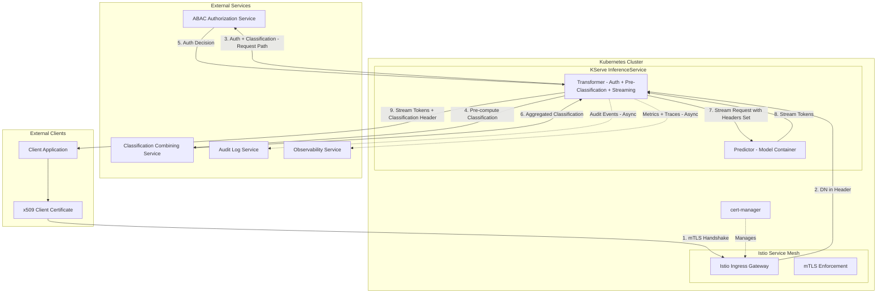
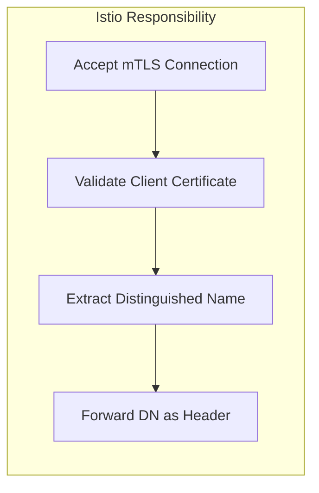
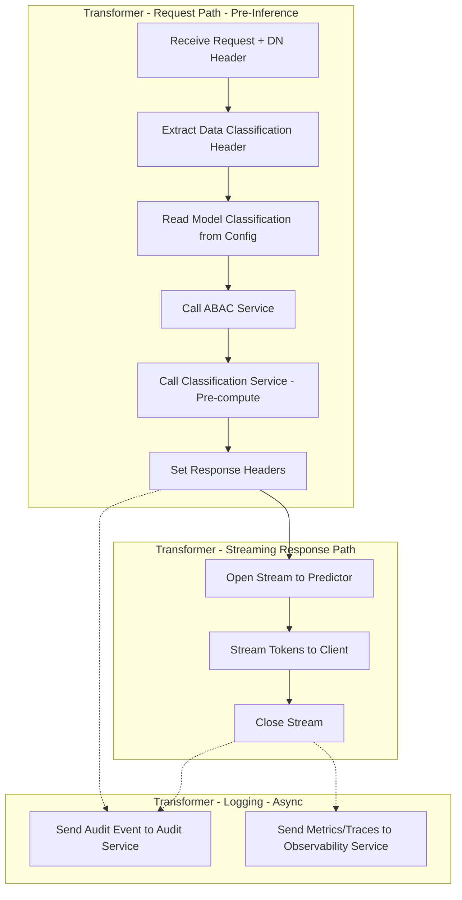
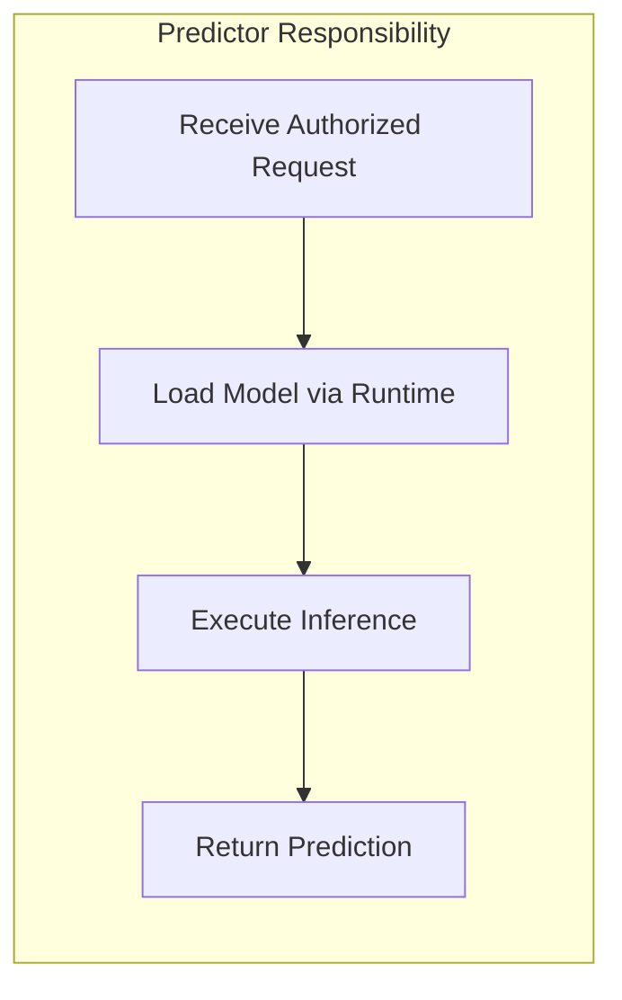
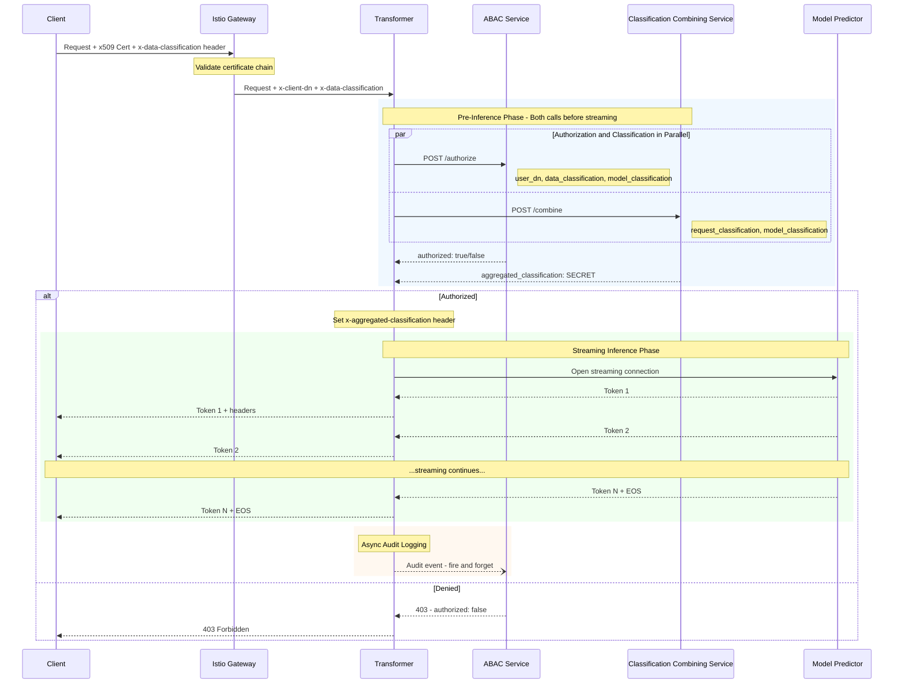
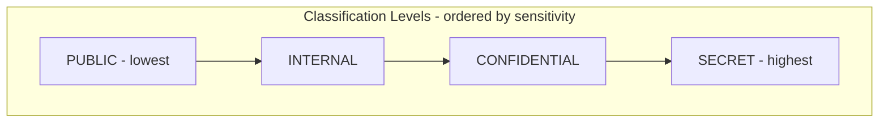
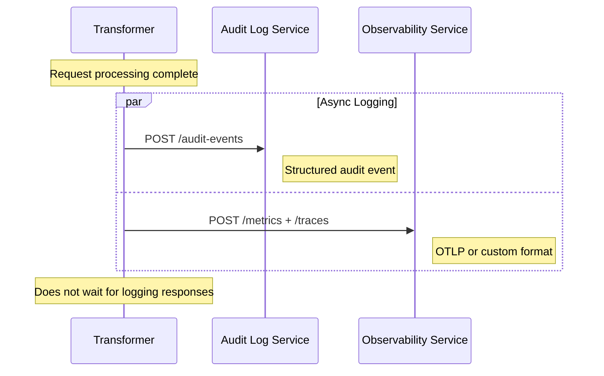
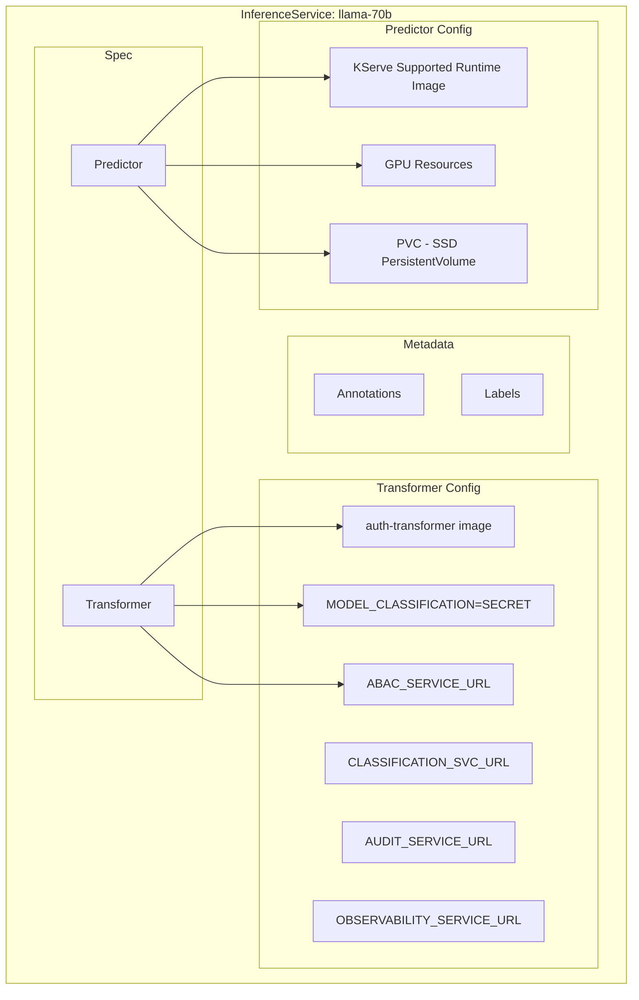
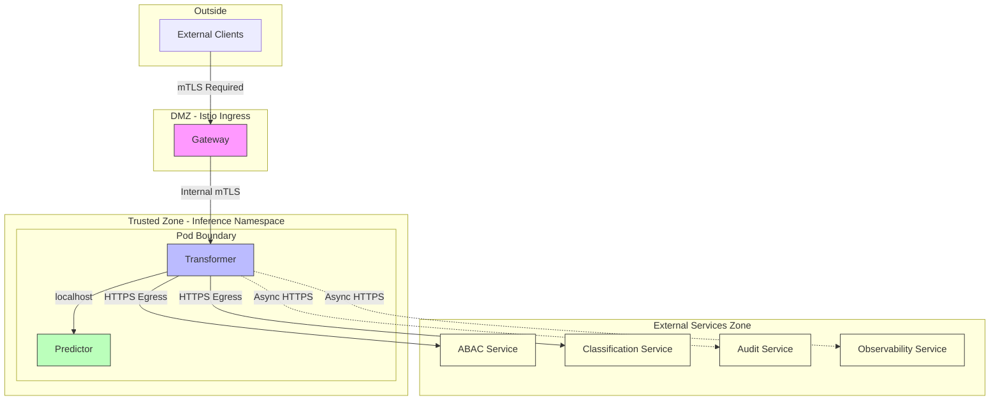

# ML Inference Deployment Architecture

## Design Principles

| Principle | Description |
|-----------|-------------|
| **Simple** | Minimal custom components, leverage platform capabilities |
| **Maintainable** | Use well-documented CNCF projects with active communities |
| **Flexible** | Pattern works across model types and classification levels |
| **Secure** | Defense in depth with separation of concerns |

---

## Scope

### In Scope

| Component | Description |
|-----------|-------------|
| Secure inference endpoint | KServe-based model serving with ABAC authorization |
| x509 Authentication | Client certificate validation via Istio mTLS |
| Classification handling | Pre-computed classification aggregation (enables streaming) |
| Response streaming | Token-by-token LLM streaming with classification headers |
| Audit and Observability | Async logging to external services |
| Model storage | PVC-backed SSD storage for model artifacts |

### Out of Scope (Future Work)

| Component | Description |
|-----------|-------------|
| Model Registry integration | MLflow, Kubeflow Model Registry, KitOps |
| Asset tracking | MLKB |
| Model deployment automation | CI/CD pipelines for model promotion |
| A/B testing / Canary deployments | Traffic splitting for model variants |

---

## Technology Stack

| Concern | Technology | CNCF Status |
|---------|------------|-------------|
| **Container Orchestration** | Kubernetes | Graduated |
| **Service Mesh / mTLS** | Istio | Graduated |
| **Certificate Management** | cert-manager | Graduated |
| **Model Serving** | KServe | Incubating |
| **Inference Runtime** | KServe Supported Runtimes | Agnostic |
| **Authorization** | ABAC Service | External |
| **Classification Combining** | Classification Combining Service | External |
| **Audit Logging** | Audit Log Service | External |
| **Observability** | Observability Service | External |

---

## High-Level Architecture



**Key Design: Pre-computed Classification for Streaming**

The classification is computed **before** inference begins, enabling token streaming without response buffering. This is possible because the aggregated classification only depends on inputs known at request time (request classification + model classification).

---

## Component Responsibilities

### Layer 1: Istio Service Mesh

**Purpose**: TLS termination, certificate validation, traffic management



| Capability | How Istio Provides It |
|------------|----------------------|
| x509 Authentication | Gateway configured with `tls.mode: MUTUAL` |
| DN Extraction | Envoy extracts `%DOWNSTREAM_PEER_SUBJECT%` |
| Header Propagation | Sets `x-client-dn` header to downstream |
| Internal mTLS | Automatic Pod-to-Pod encryption |

### Layer 2: KServe Transformer

**Purpose**: ABAC authorization, pre-computed classification, response streaming, audit and observability logging



| Capability | How Transformer Provides It |
|------------|----------------------------|
| ABAC Integration | REST call to auth service with 3 attributes (request path) |
| Pre-computed Classification | Classification computed BEFORE inference, enabling streaming |
| Response Streaming | Tokens streamed directly through without buffering |
| Header Injection | `x-aggregated-classification` set before streaming begins |
| Model Classification | Reads from environment variable or ConfigMap mount |
| Request Validation | Can validate/sanitize inputs before inference |
| Audit Logging | Sends structured audit events to external Audit Log Service |
| Observability | Sends metrics and traces to external Observability Service |

### Why Pre-compute Classification?

The aggregated classification depends only on:
1. **Request classification** (from `x-data-classification` header) - known at request time
2. **Model classification** (from environment variable) - known at request time

Neither depends on inference output, so we can compute the classification **before** inference and set headers immediately. This enables true streaming without response buffering.

### Layer 3: KServe Predictor

**Purpose**: Execute model inference using KServe supported runtimes



| Capability | How KServe Provides It |
|------------|------------------------|
| Model Serving | Pluggable serving runtimes (Triton, TorchServe, TensorFlow Serving, etc.) |
| GPU Acceleration | Native support via runtime configuration |
| Scaling | KServe autoscaling based on demand (KPA or HPA) |
| Health Checks | Liveness/readiness probes |
| Protocol Support | V1/V2 inference protocol, gRPC, REST |
| Model Storage | PVC with fast SSD-backed PersistentVolume |

---

## Model Storage Configuration

Models are stored on **PersistentVolumeClaims (PVCs)** backed by fast SSD storage for optimal loading performance.

```mermaid
flowchart LR
    subgraph Storage Infrastructure
        SC[StorageClass: fast-ssd]
        PV[PersistentVolume - SSD]
        PVC[PersistentVolumeClaim]
    end

    subgraph KServe Pod
        PR[Predictor Container]
        VOL[/models mount]
    end

    SC -->|Provisions| PV
    PVC -->|Binds| PV
    VOL -->|Mounts| PVC
    PR --> VOL
```

| Configuration | Value |
|---------------|-------|
| **StorageClass** | Fast SSD class (e.g., `premium-ssd`, `fast-nvme`) |
| **Access Mode** | `ReadWriteOnce` or `ReadOnlyMany` for shared models |
| **Mount Path** | `/mnt/models` (configurable per InferenceService) |
| **Capacity** | Sized per model requirements |

### Benefits of PVC-based Model Storage

| Benefit | Description |
|---------|-------------|
| **Fast loading** | SSD-backed storage provides low-latency model loading |
| **Persistence** | Models persist across pod restarts |
| **Pre-staging** | Models can be pre-downloaded before inference pods start |
| **Isolation** | Each model can have its own PVC for security isolation |

---

## ABAC Authorization and Classification Flow (Streaming-Enabled)



### Streaming Design Rationale

| Aspect | Design Decision | Benefit |
|--------|-----------------|---------|
| **Classification timing** | Pre-computed before inference | Headers set before first token, enables streaming |
| **Parallel calls** | ABAC and Classification called in parallel | Reduces latency |
| **No response buffering** | Tokens streamed directly | Low first-token latency |
| **Async audit** | Logging after stream completes | No latency impact |

---

## Classification Combining Service

**Purpose**: Compute the aggregated classification from request and model classifications

### API Contract

| Endpoint | Method | Description |
|----------|--------|-------------|
| `/combine` | POST | Combine two classifications and return the aggregate |

### Request/Response

```json
// POST /combine
// Request
{
  "request_classification": "CONFIDENTIAL",
  "model_classification": "SECRET"
}

// Response
{
  "aggregated_classification": "SECRET"
}
```

### Classification Hierarchy Example



The aggregated classification is typically the **higher** of the two input classifications, though the external service may implement more complex rules based on organizational policy.

---

## Audit and Observability Services

The Transformer sends logs to two external services asynchronously (non-blocking to the request path).


### Logging Flow



---

## KServe InferenceService Structure



---

## Security Boundaries



| Boundary | Protection |
|----------|------------|
| Internet → Gateway | x509 client certificate required |
| Gateway → Pod | Istio mTLS (automatic) |
| Transformer → Predictor | Same pod (localhost) |
| Transformer → External Services | HTTPS, NetworkPolicy allows egress |

---

## Deployment Pattern Summary

| Component | Image Source | Scaling | Configuration |
|-----------|--------------|---------|---------------|
| Istio Gateway | istio/proxyv2 | HPA | Gateway, VirtualService |
| Transformer | Custom (simple REST proxy) | Part of InferenceService | Environment variables |
| Predictor | KServe supported runtimes | KServe autoscaler | InferenceService spec |
| ABAC Service | External | Managed externally | Endpoint URL in Transformer config |
| Classification Service | External | Managed externally | Endpoint URL in Transformer config |
| Audit Log Service | External | Managed externally | Endpoint URL in Transformer config |
| Observability Service | External | Managed externally | Endpoint URL in Transformer config |

---

## Key Design Decisions

| Decision | Rationale |
|----------|-----------|
| **Istio for mTLS** | CNCF graduated, native x509 support, no code changes to services |
| **KServe Transformer for auth** | Native KServe pattern, co-located with model config, single deployment unit |
| **Pre-computed classification** | Enables response streaming by setting headers before inference starts |
| **Parallel ABAC + Classification** | Reduces pre-inference latency by calling both services concurrently |
| **Model classification as env var** | Simple, immutable per deployment, no external lookups |
| **PVC with SSD storage** | Fast model loading, persistence across restarts, pre-staging capability |
| **External ABAC service** | Centralized policy management, reusable across clusters, independently managed |
| **External Classification service** | Centralized classification rules, consistent policy across systems |
| **External Audit and Observability** | Compliance requirements, centralized logging infrastructure, async to avoid latency impact |

---

## Implementation Checklist

- [ ] Configure Istio Gateway for mTLS with client certificate validation
- [ ] Build Auth Transformer container image with:
  - External ABAC service integration (request path)
  - Pre-computed Classification (request path, before inference)
  - Response streaming support (no buffering)
  - Header injection before streaming begins
  - Async logging to Audit Log Service
  - Async logging to Observability Service
- [ ] Configure external ABAC Authorization Service endpoint
- [ ] Configure external Classification Combining Service endpoint
- [ ] Configure external Audit Log Service endpoint
- [ ] Configure external Observability Service endpoint
- [ ] Create StorageClass for fast SSD storage
- [ ] Create PersistentVolumeClaims for model storage
- [ ] Create InferenceService manifests with Transformer + Predictor + PVC
- [ ] Configure NetworkPolicies for isolation (allow egress to external services)
- [ ] Set up cert-manager for certificate lifecycle
- [ ] Test end-to-end streaming with classification headers
- [ ] Document operational runbooks
